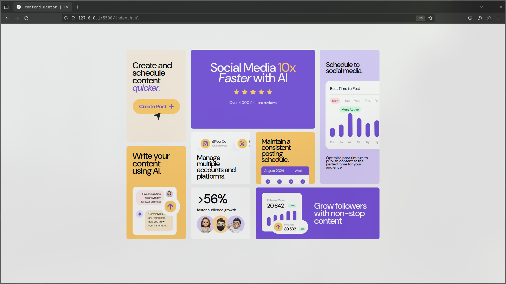

# Frontend Mentor - Bento grid solution

This is a solution to the [Bento grid challenge on Frontend Mentor](https://www.frontendmentor.io/challenges/bento-grid-RMydElrlOj). Frontend Mentor challenges help you improve your coding skills by building realistic projects.

## Table of contents

- [Overview](#overview)
  - [The challenge](#the-challenge)
  - [Screenshot](#screenshot)
  - [Links](#links)
- [My process](#my-process)
  - [Built with](#built-with)
  - [What I learned](#what-i-learned)
  - [Continued development](#continued-development)
  - [Useful resources](#useful-resources)
- [Author](#author)

**Note: Delete this note and update the table of contents based on what sections you keep.**

## Overview

This is my attempt on finishing Frontend Mentor Challenge "Bento Grid".
Time Spent: 5 Hours 14 minutes

### The challenge

Users should be able to:

- View the optimal layout for the interface depending on their device's screen size

### Screenshot

### Links

- Solution URL: [Add solution URL here](https://github.com/JavaneseIvankov/bento-grid/tree/answer-main)
- Live Site URL: [Add live site URL here](https://your-live-site-url.com)

## My process

- Setting up CSS Styles Boilerplates (colors, fonts, reset),
- Reading docs and searching about the best layout for this use case.
- HTML Structure
- Styling (Desktop View)
- Styling + Added Responsiveness (Mobile View)

### Built with

- Semantic HTML5 markup
- CSS custom properties
- Flexbox
- CSS Grid
- Desktop-first workflow

### What I learned

#### General

- Dealing with grid layout,
- How to use relative sizing like vw, vh, and percent,
- When to use relative sizing vs px,
- Organizing CSS in a more semantic-grouped manner.

#### Detailed

- Grid layout allows you to use percent as gap, whereas flexbox do not.
- Padding matters a lot in styling, if not use carefully, it'll make your life a much harder.

### Continued development

- I am curious wheter it's possible to achieve same results purely with auto-gridand / or flexbox.

### Useful resources

- [MDN Official Documentation](https://developer.mozilla.org/en-US/) - The GOAT Docs
- [Joshwcomeau's CSS Reset](https://www.joshwcomeau.com/css/custom-css-reset/) - CSS Reset

## Author

- Frontend Mentor - [@JavaneseIvankov](https://www.frontendmentor.io/profile/JavaneseIvankov)
